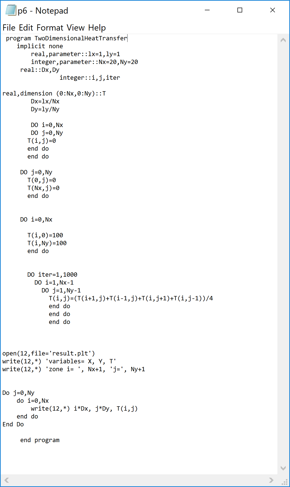
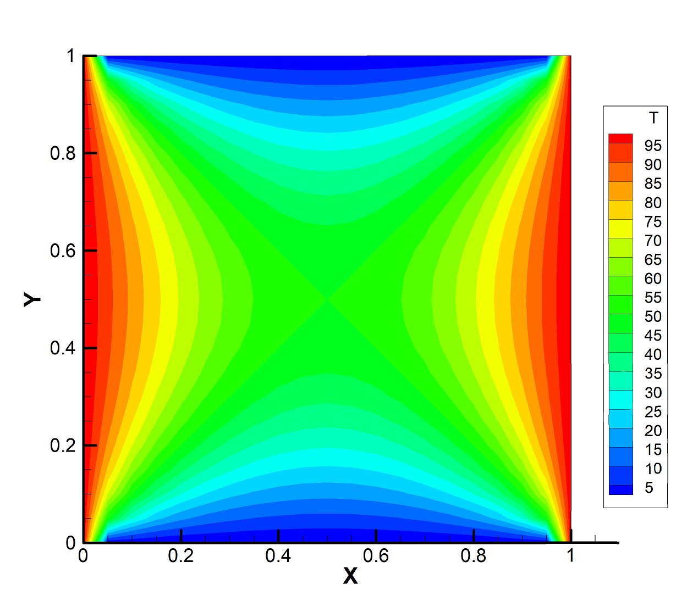
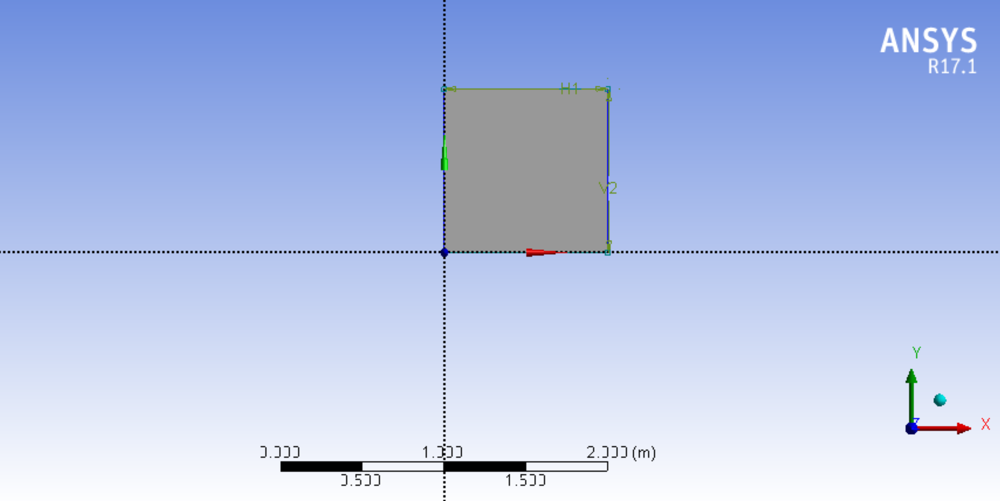
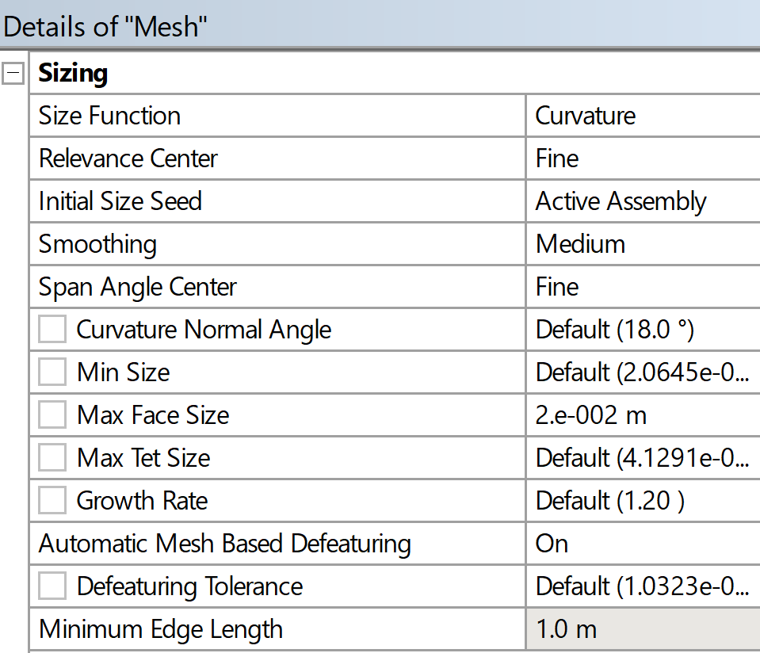
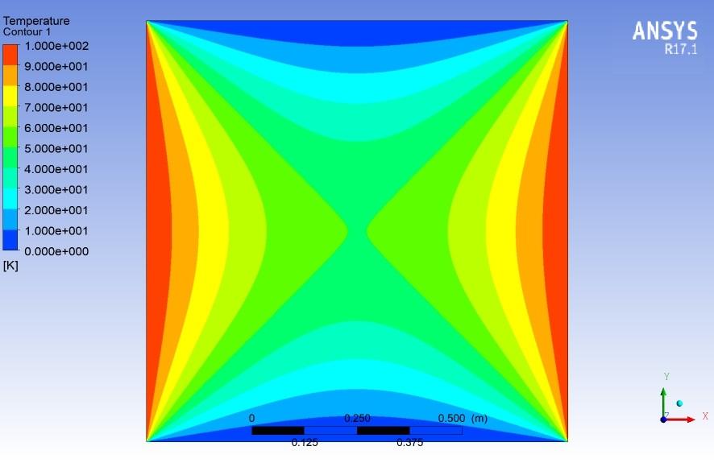
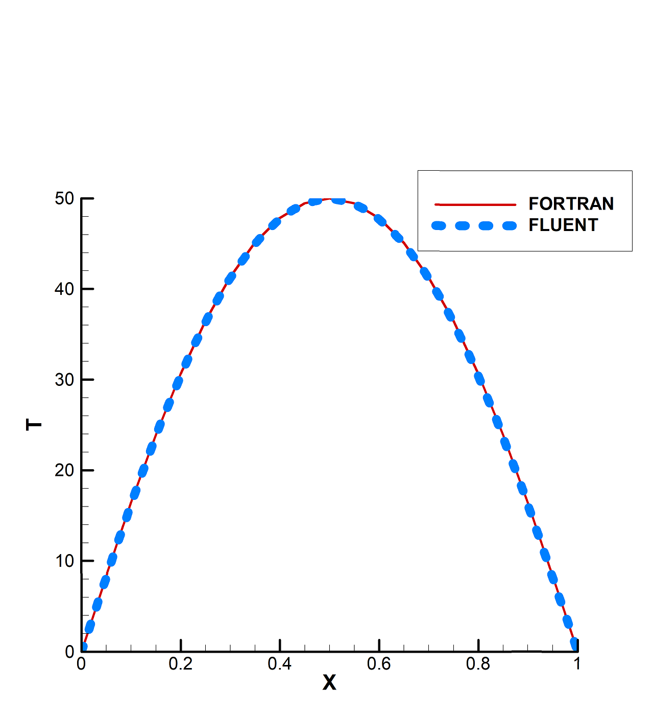
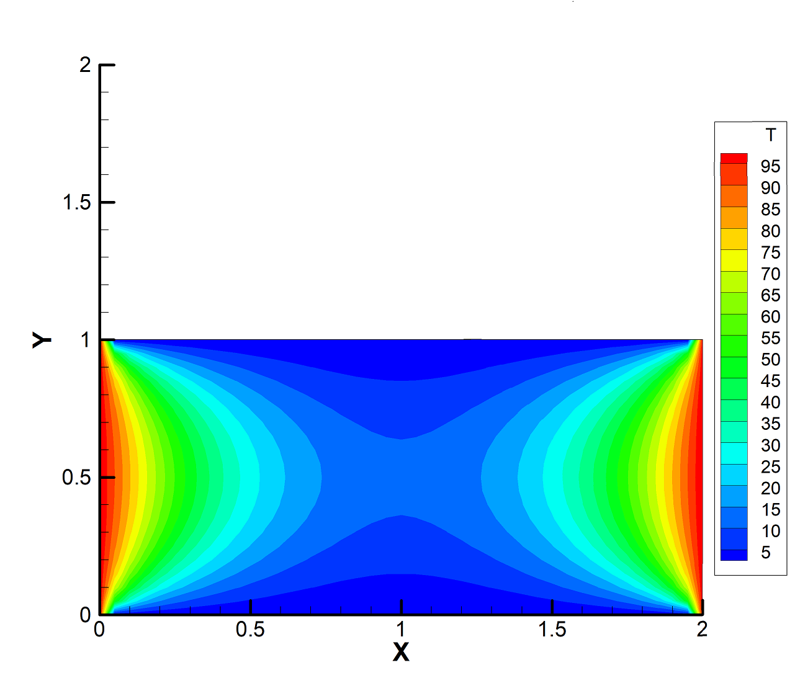
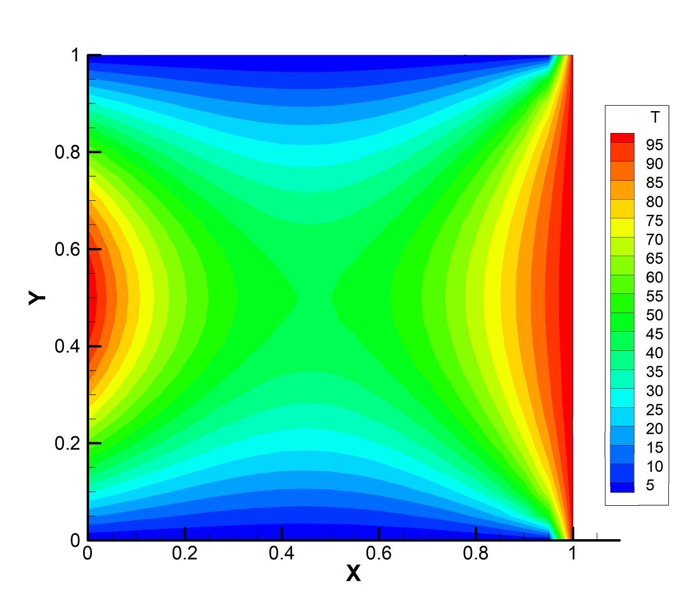

# 2D Steady-State Heat Transfer using Fortran and Finite Difference Method

## Overview

This project presents the numerical solution of the two-dimensional steady-state heat conduction equation using the **Finite Difference Method (FDM)** implemented in **Fortran**.

The numerical results obtained from the Fortran code were validated against simulations performed in **ANSYS Fluent**. In addition, parametric studies were conducted to investigate the effects of geometry aspect ratio and spatially varying boundary conditions on temperature distribution.

The project combines:

* Numerical heat transfer
* Finite difference discretization
* Fortran programming
* CFD validation using ANSYS Fluent
* Temperature contour visualization

---

## Problem Description

The problem consists of steady-state two-dimensional heat conduction in a square domain.

### Initial Boundary Conditions

* Horizontal boundaries: constant temperature of 0°C
* Vertical boundaries: constant temperature of 100°C

The governing equation is the 2D steady-state heat equation without heat generation.

The finite difference discretization used in the code is:

```text
T(i,j) = ( T(i+1,j) + T(i-1,j) + T(i,j+1) + T(i,j-1) ) / 4
```

---

## Numerical Method

The computational domain was discretized into a structured grid using the finite difference method.

### Mesh Specifications

| Parameter | Value |
| --------- | ----- |
| Nx        | 20    |
| Ny        | 20    |

The temperature at each grid point was calculated iteratively until convergence.

---

## Software Used

* Fortran
* Tecplot
* ANSYS Fluent
* ANSYS Meshing

---

## Fortran Implementation

The numerical solution was implemented in Fortran using iterative finite difference calculations.

### Fortran Code



---

## Tecplot Temperature Contours

The temperature contours generated from the Fortran output were visualized using Tecplot.

### Tecplot Contour



---

## ANSYS Fluent Validation

The same heat transfer problem was solved in ANSYS Fluent using identical geometry and boundary conditions for validation purposes.

---

## Fluent Geometry



---

## Fluent Mesh



---

## Fluent Temperature Contours



---

## Comparison between Fortran and Fluent

The temperature distributions obtained from the Fortran code and Fluent simulation showed strong agreement, validating the numerical implementation.

### Comparison Plot



---

## Parametric Study — Geometry Aspect Ratio

The effect of changing the length-to-width ratio of the domain was investigated.

The domain length in the x-direction was doubled while maintaining uniform grid spacing.

### Modified Geometry Temperature Contour



### Observation

Increasing the domain length reduced heat penetration into the interior region of the geometry.

---

## Parametric Study — Spatially Varying Boundary Conditions

The boundary conditions were modified to make temperature dependent on spatial position:

```text
T(i,0)  = 100 × sin(i × π / Nx)
T(i,Ny) = 100 × sin(i × π / Nx)
```

### Variable Boundary Condition Contour



### Observation

Spatially varying boundary conditions significantly changed the temperature distribution throughout the domain.

---

## Key Learning Outcomes

This project demonstrates:

* Application of finite difference methods
* Numerical solution of partial differential equations
* Heat transfer modeling
* Validation of numerical methods using CFD software
* Scientific computing with Fortran
* Mesh-based numerical analysis

---

## Repository Structure

```text
2d-steady-state-heat-transfer/
│
├── README.md
│
├── report/
│   └── 2d-heat-transfer-report.pdf
│
├── code/
│   └── heat_transfer.f90
│
├── images/
│   ├── fortran-code.png
│   ├── tecplot-contour.png
│   ├── fluent-geometry.png
│   ├── fluent-mesh.png
│   ├── fluent-contour.png
│   ├── fortran-vs-fluent.png
│   ├── aspect-ratio-study.png
│   └── variable-boundary-condition.png
│
└── notes/
    └── simulation-setup.md
```

---

## Conclusions

* The finite difference solution implemented in Fortran produced results that closely matched ANSYS Fluent simulations.
* The temperature field behaved as expected for steady-state heat conduction.
* Increasing domain length reduced heat penetration into the interior region.
* Variable boundary conditions strongly influenced the global temperature distribution.

---

## References

1. Numerical Heat Transfer and Fluid Flow — Suhas V. Patankar
2. ANSYS Fluent Documentation
3. Finite Difference Method literature

---

## Author

**Ali Darfashi**
Mechanical Engineering Student
CFD and Numerical Heat Transfer Enthusiast
